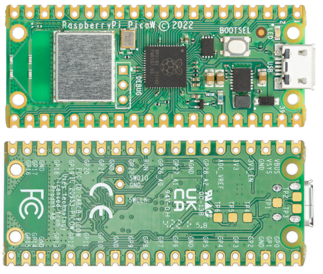
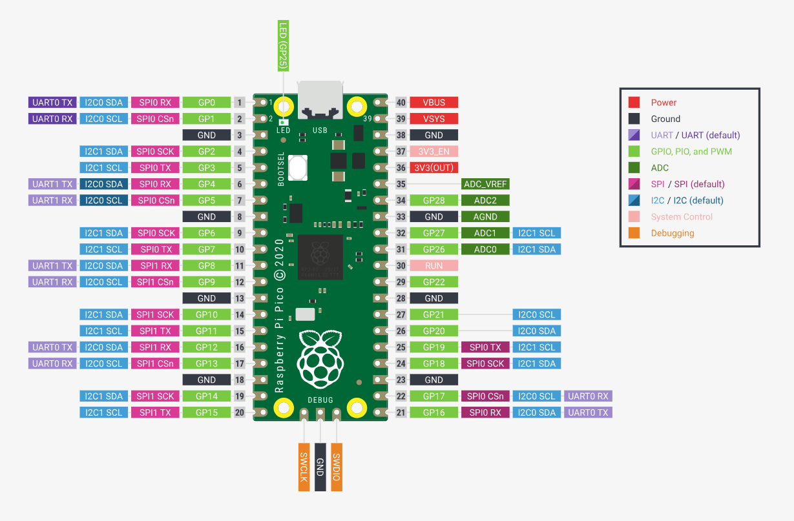

# Relatório Técnico Raspberry Pi Pico W

**Autora**: Sarah Ribeiro  
**Instituição**: Inteli - Instituto de Tecnologia e Liderança  
**Curso:** Ciência da Computação  

## Índice
- [Relatório Técnico Raspberry Pi Pico W](#relatório-técnico-raspberry-pi-pico-w)
  - [Índice](#índice)
  - [Introdução](#introdução)
  - [Manual de Referência](#manual-de-referência)
    - [Relatório Técnico](#relatório-técnico)
  - [Interfaces de Comunicação](#interfaces-de-comunicação)
  - [Prova de Conceito](#prova-de-conceito)
  - [Conclusão](#conclusão)

## Introdução
O ponto central deste relatório concentra-se no estudo da plataforma embarcada Raspberry Pi Pico W, uma placa microcontrolada de baixo custo e alta performance, oferecendo flexibilidade através de interfaces digitais. A programação desta placa pode ser realizada em C/C++, utilizando o SDK da Raspberry, bibliotecas do Arduino, além de suportar MicroPython e CircuitPython.

## Manual de Referência

### Relatório Técnico

- Microcontrolador RP2040 (Silicon Designed by Raspberry Pi)
- Dual-Core ARM Cortex M0+ com clock até 133MHz
- 264kB de memória SRAM
- 2MB de memória Flash
- 26 pinos de GPIO multifunção
- 2× SPI, 2× I2C, 2× UART, 3× 12-bit ADC e 16× canais PWM controláveis
- Conectividade via WiFi 2.4GHz 802.11n
- Certificação ANATEL: 134082210629
- USB 1.1 com suporte para dispositivo e host
- Programação arrastar e soltar usando armazenamento em massa via USB

A disposição dos pinos do RP2040 na Raspberry Pi Pico W é crucial para a interação com o ambiente. A Figura 2 representa a disposição desses pinos, indicando as funções internas e a distribuição nas laterais esquerda e direita da placa.

A reprogramação do flash pode ser realizada via USB (arrastar e soltar) ou através da porta de depuração serial (SWD), que permite carregar e executar código sem pressionamento de botão.

## Interfaces de Comunicação

A Raspberry Pi Pico W suporta diversas interfaces de comunicação, proporcionando versatilidade em aplicações. Destacam-se:

**GPIO (General-Purpose Input/Output):**

- As GPIOs permitem que o Raspberry Pi Pico W envie ou receba sinais digitais. Elas podem ser configuradas como entradas ou saídas e são fundamentais para a interação com sensores, LEDs, botões e outros dispositivos.

**UART (Universal Asynchronous Receiver-Transmitter):**

- O Raspberry Pi Pico W suporta comunicação serial UART. Isso é útil para a comunicação ponto a ponto entre o Pico W e outros dispositivos, como sensores, módulos GPS, e outros microcontroladores.

**USB (Universal Serial Bus):**

- A presença de portas USB no Raspberry Pi Pico W permite a comunicação com outros dispositivos, como computadores, teclados, mouses e outros periféricos USB.

**Comunicação sem Fio:**

- O Raspberry Pi Pico W pode ser equipado com recursos sem fio, como Wi-Fi ou Bluetooth, isso abre possibilidades de comunicação remota e conectividade com outros dispositivos.

## Prova de Conceito

**Conexão via GPIO com Sensor DHT22**
A prova de conceito consistiu na conexão do Raspberry Pi Pico W com o sensor DHT22 de temperatura e umidade, utilizando a interface GPIO. A comunicação bidirecional entre a placa e o sensor permitiu a leitura precisa dos dados ambientais. O código desenvolvido em C/C++ demonstrou a eficácia da plataforma embarcada na integração com periféricos, evidenciando a capacidade do Pico W em aplicações práticas.

É possível verificar a demonstração da aplicação acessando esse [projeto](https://wokwi.com/projects/379310165832565761). 

## Conclusão 
Explorando a Raspberry Pi Pico W, descobrimos sua incrível versatilidade e simplicidade, ótimos para uma variedade de projetos embarcados. As opções de comunicação disponíveis tornam as interações ainda mais personalizadas e específicas. Além disso, ao testarmos a plataforma com sensores, ficou evidente sua eficiência.

Neste relatório, buscamos oferecer uma visão completa da Raspberry Pi Pico W, destacando não apenas suas especificações técnicas, mas também demonstrando sua utilidade prática por meio da prova de conceito.